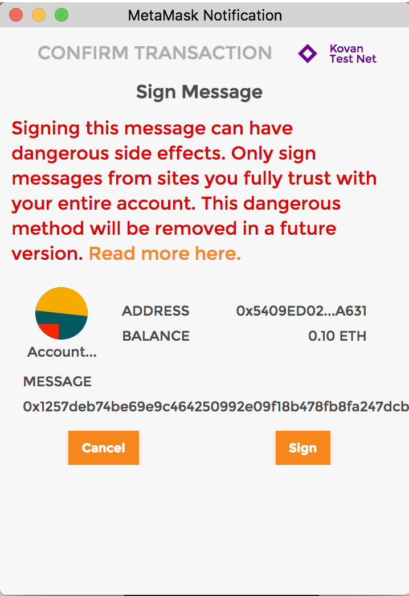
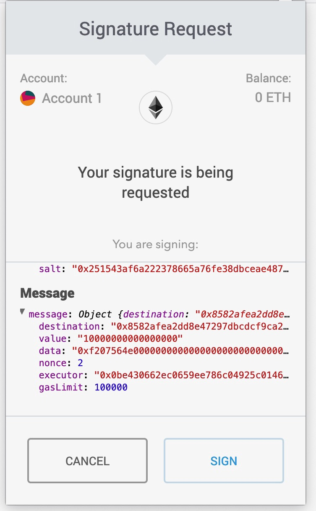

# SimpleMultiSig updates: EIP712 and security audit

*Christian Lundkvist, 2019-02-05*

We will here present some updates to the [SimpleMultisig](https://github.com/christianlundkvist/simple-multisig) smart contract. Recently the [EIP712](https://eips.ethereum.org/EIPS/eip-712) specification was finalized and so adding this functionality to the SimpleMultiSig contract was a natural choice. Also [ConsenSys Diligence](https://consensys.net/diligence/) recently finished an audit of the SimpleMultiSig smart contract. We will discuss some changes to the smart contract that were made following the audit report.

# EIP712

Recall that [EIP712](https://eips.ethereum.org/EIPS/eip-712) is a signature scheme that allows structured data in JSON format to be digitally signed in a way where the signature can be easily verified in a smart contract. Before EIP712 if you wanted to sign some data using an Ethereum wallet to be verified in a smart contract your only option was to basically sign an opaque hash:

This is both a bad user experience as well as problematic from a security perspective, since the user does not know what they are signing. Using EIP712 as the signature scheme the user is instead presented with the following structured data:

Here the user can see directly the details of what they are signing, which is both a better experience and more secure. The MetaMask browser plugin supports EIP712 and since the EIP is now finalized we should expect more wallets to take advantage of it.

To test out the EIP712 support in the SimpleMultiSig contract we include a [test webpage](https://github.com/christianlundkvist/simple-multisig/blob/master/browsertest/index.html) that you can use to create and sign SimpleMultiSig EIP712 data using MetaMask.

# Audit and contract updates

Recently ConsenSys Diligence wrapped up an audit of the SimpleMultiSig contract. The audit report is [avaliable here](files/multisig-diligence-audit.pdf). The audit report was positive and no major issues were found. In order to minimize replay attacks the report suggested adding an "executor" to the signed data. The executor is the Ethereum address sending the signature data to the contract. The addition of this data makes it so that only the executor can replay failed transactions, so it is a considerable mitigation of any risks of replay attacks.

It will still be possible to use the zero address as executor in which case anyone can send the transaction. This is useful in cases where replay attacks is not a big concern, and when you may have several people who should be able to send off a signed transaction.

In the latest version of the SimpleMultiSig contract we include an executor in the signed data, and we also include the amount of gas that we want to pass on to the function call. This is a pretty niche functionality but it might make sense for instance if we want to make sure that the recieving contract cannot perform any computations apart from receiving ETH.
